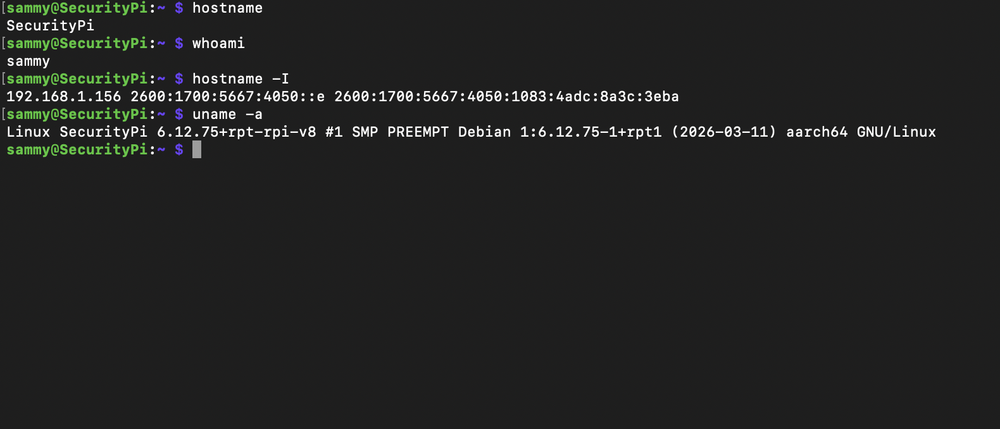
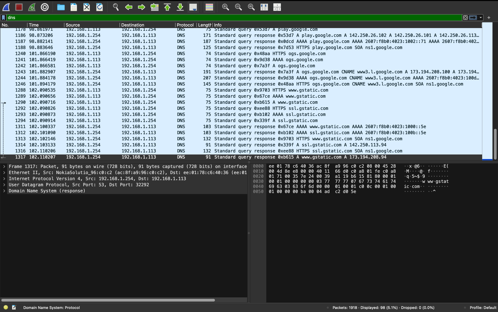

# Home Cybersecurity Lab

## Overview

This repository documents my personal cybersecurity and IT home lab environment. The purpose of this lab is to gain hands-on experience with networking, Linux administration, Windows systems, log analysis, and security monitoring.

The lab is being built using a Raspberry Pi, Windows Server virtual machines, networking tools, and security-focused software to simulate real-world troubleshooting and administration tasks.

---

## Technologies Used

- Raspberry Pi
- Linux
- SSH
- Windows Server
- Splunk
- Wireshark
- Docker
- Kali Linux
- PowerShell

---

## Current Lab Progress

### Raspberry Pi Remote Administration

Successfully configured remote access to a Raspberry Pi over SSH and performed Linux system administration tasks from a MacBook terminal.

Tasks performed:
- Verified hostname and active user
- Checked network connectivity and IP addressing
- Troubleshot SSH connection issues
- Validated Linux system information
- Tested remote terminal access

---

## Network Traffic Analysis with Wireshark

Used Wireshark to capture and analyze live network traffic from a local workstation. Applied protocol filtering to inspect DNS traffic and observe communication between client devices and external services.

Tasks performed:
- Captured live packets
- Filtered DNS traffic
- Reviewed source and destination addresses
- Observed protocol behavior
- Practiced basic packet analysis

### Screenshot

---

## Skills Practiced

- Linux command line
- Remote administration
- SSH configuration and troubleshooting
- Basic networking
- System administration
- Troubleshooting connectivity issues

---

## Goals

- Build a functioning home SOC lab
- Practice Windows log analysis
- Learn SIEM monitoring with Splunk
- Analyze traffic using Wireshark
- Improve networking and cybersecurity skills
- Continue preparing for CompTIA Security+
