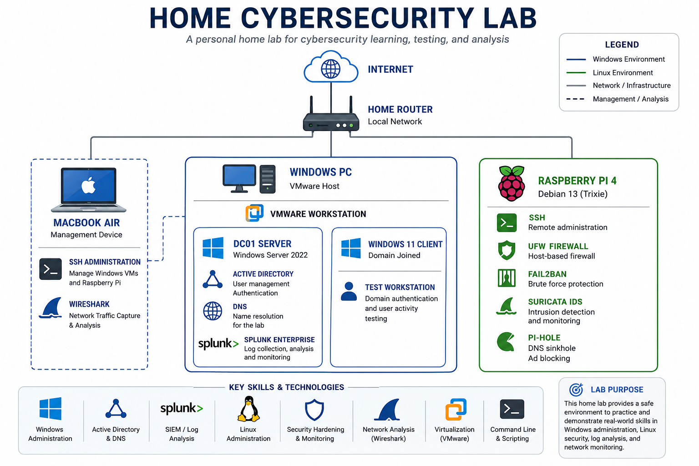

# 🛡️ Home Cybersecurity Lab

A hands-on home cybersecurity lab built to strengthen practical skills in Windows administration, Active Directory, Linux security, SIEM, virtualization, and network analysis.

This repository documents the lab environment, configuration, and projects I've completed while developing real-world IT and cybersecurity experience.

---

# 🖥️ Lab Architecture

---

# 📂 Projects

## 🪟 Windows Security Lab

A Windows Server 2022 Active Directory environment built in VMware.

**Highlights**
- Windows Server 2022 Domain Controller
- Active Directory
- DNS
- Windows 11 Domain Client
- Splunk Enterprise
- Event Viewer log analysis
- User management and authentication

➡️ [View Windows Security Lab](windows-security-lab/)

---

## 🍓 Linux Security Appliance Lab

A Raspberry Pi configured as a Linux security appliance.

**Highlights**
- Debian 13 (Trixie)
- SSH Administration
- UFW Firewall
- Fail2Ban
- Suricata IDS
- Pi-hole DNS Sinkhole

➡️ [View Raspberry Pi Lab](raspberry-pi-lab/)

---

## 🌐 Network Traffic Analysis

Hands-on packet capture and protocol analysis using Wireshark.

**Highlights**
- DNS traffic analysis
- Packet inspection
- Protocol filtering
- Network troubleshooting

➡️ [View Network Traffic Analysis](network-traffic-analysis/)

---

# 💻 Technologies Used

- Windows Server 2022
- Windows 11
- Active Directory
- DNS
- Splunk Enterprise
- VMware Workstation
- Debian Linux
- Raspberry Pi 4
- SSH
- UFW
- Fail2Ban
- Suricata
- Pi-hole
- Wireshark

---

# 🎯 Skills Demonstrated

- Windows Administration
- Active Directory Management
- Linux Administration
- SIEM & Log Analysis
- Network Security
- Network Traffic Analysis
- Security Hardening
- Virtualization
- System Troubleshooting

---

# 📖 Purpose

This repository showcases hands-on cybersecurity and systems administration experience developed through a self-built home lab. It serves as a portfolio demonstrating practical knowledge applicable to IT Support, Systems Administration, and Cybersecurity roles.
