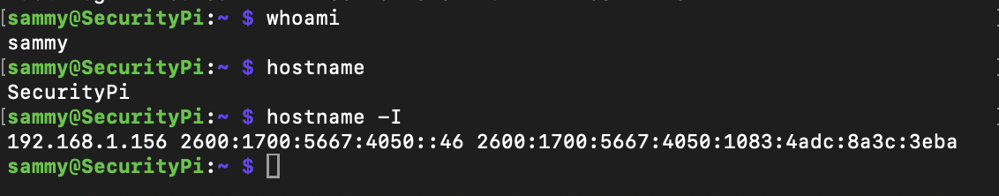
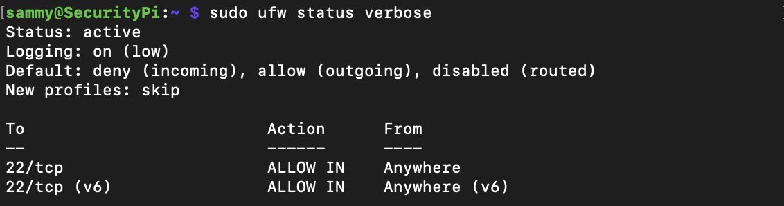
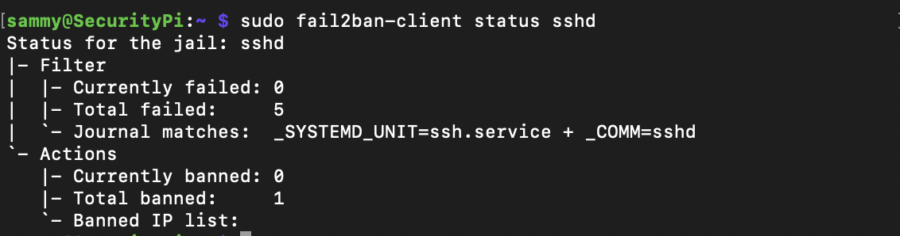
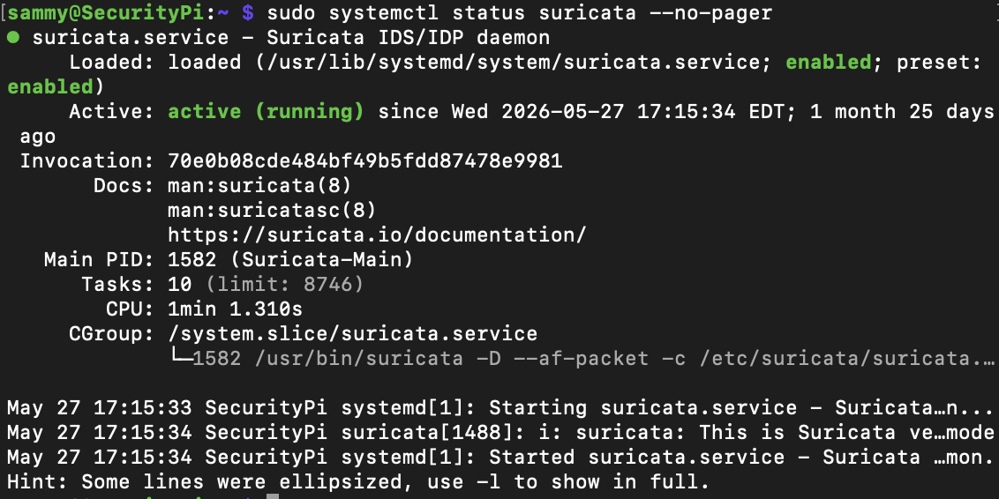
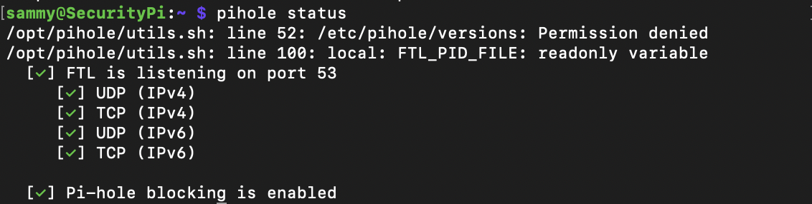
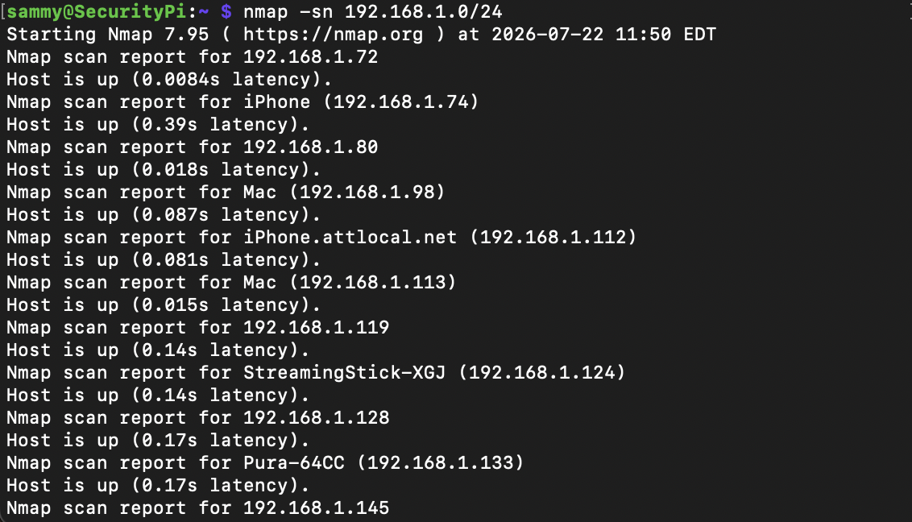

# Raspberry Pi Security Lab

## Overview

This project demonstrates the configuration and hardening of a Raspberry Pi running Debian Linux. The system was configured as a lightweight security appliance to gain hands-on experience with Linux administration, secure remote access, host hardening, intrusion prevention, DNS filtering, and basic network reconnaissance.

---

## Lab Environment

| Component | Technology |
|-----------|------------|
| Hardware | Raspberry Pi |
| Operating System | Debian GNU/Linux 13 (Trixie) |
| Remote Administration | OpenSSH |
| Firewall | UFW (Uncomplicated Firewall) |
| Intrusion Prevention | Fail2Ban |
| Network Intrusion Detection | Suricata IDS/IPS |
| DNS Filtering | Pi-hole |
| Network Reconnaissance | Nmap |

---

## Project Objectives

- Configure secure remote administration using SSH.
- Harden the operating system with a host-based firewall.
- Protect SSH against repeated login attempts with Fail2Ban.
- Deploy Suricata to monitor network traffic for suspicious activity.
- Configure Pi-hole to provide DNS-based filtering.
- Practice Linux administration and network troubleshooting.
- Perform basic network discovery using Nmap.

---

## Technologies Used

### OpenSSH

Configured secure remote administration to manage the Raspberry Pi over the local network.

**Skills Demonstrated**

- Secure remote administration
- Linux command line
- SSH authentication

---

### UFW Firewall

Configured UFW with a default-deny inbound policy while allowing SSH access for remote administration.

**Skills Demonstrated**

- Host firewall configuration
- Network security
- Linux system hardening

---

### Fail2Ban

Configured Fail2Ban to monitor SSH authentication attempts and automatically protect against repeated login failures.

**Skills Demonstrated**

- Brute-force mitigation
- Log monitoring
- Linux security

---

### Suricata IDS

Installed and configured Suricata as a host-based intrusion detection system to monitor network traffic.

**Skills Demonstrated**

- Intrusion Detection
- Network monitoring
- Linux services

---

### Pi-hole

Configured Pi-hole to provide DNS filtering and network-wide advertisement and domain blocking.

**Skills Demonstrated**

- DNS
- Network services
- Linux administration

---

### Nmap

Used Nmap to perform host discovery and basic network reconnaissance within the local network.

**Skills Demonstrated**

- Network discovery
- Reconnaissance
- TCP/IP fundamentals

---

# Screenshots

## SSH Remote Administration

---

## UFW Firewall Configuration

---

## Fail2Ban SSH Protection

---

## Suricata IDS Running

---

## Pi-hole Status

---

## Nmap Host Discovery

---

# Key Skills Demonstrated

- Linux Administration
- Debian Linux
- SSH Remote Administration
- UFW Firewall
- Fail2Ban
- Suricata IDS
- Pi-hole
- Nmap
- Network Security
- Host Hardening
- Intrusion Detection
- DNS Administration
- Network Reconnaissance

---

# Lessons Learned

This project provided practical experience securing a Linux system through multiple layers of defense. It reinforced Linux administration skills, secure remote access, firewall configuration, intrusion prevention, DNS filtering, and network monitoring while building a reusable cybersecurity home lab.
