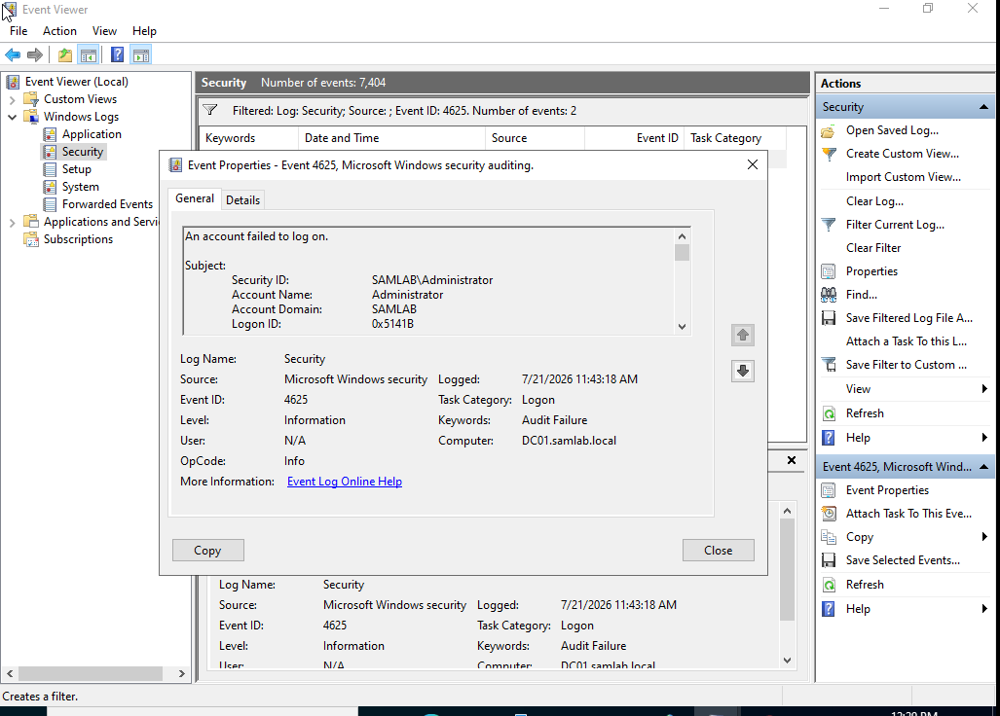
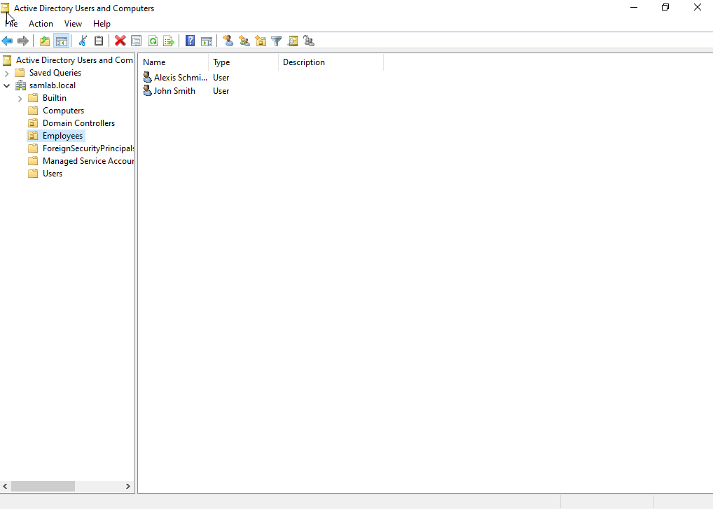

# Windows Security Lab

## Overview

This lab simulates a Windows enterprise environment using VMware Workstation, Windows Server 2022, Windows 11, Active Directory, DNS, and Splunk Enterprise.

The objective was to configure a Windows domain, generate authentication events, and investigate Windows Security logs through a SIEM.

---

## Lab Environment

| Component | Technology |
|-----------|------------|
| Hypervisor | VMware Workstation |
| Domain Controller | Windows Server 2022 |
| Client | Windows 11 |
| Directory Service | Active Directory Domain Services |
| DNS | Windows DNS |
| SIEM | Splunk Enterprise |

---

## Objectives

- Build an Active Directory domain
- Join a Windows client to the domain
- Create and manage domain users
- Generate authentication activity
- Investigate Windows Security Events
- Analyze authentication logs using Splunk

---

## Authentication Investigation

A failed authentication attempt was intentionally generated using a domain account.

The event was verified in both Windows Event Viewer and Splunk Enterprise.

### Successful Logons

```
index=* EventCode=4624
```

### Failed Logons

```
index=* EventCode=4625
```

---

## Skills Demonstrated

- Active Directory Administration
- Windows Authentication
- Windows Event Viewer
- Windows Security Logs
- Splunk Enterprise
- Security Event Investigation

---

## Screenshots

### Failed Logon (4625)


### Successful Logon (4624)


### Event Viewer Investigation



### Active Directory


