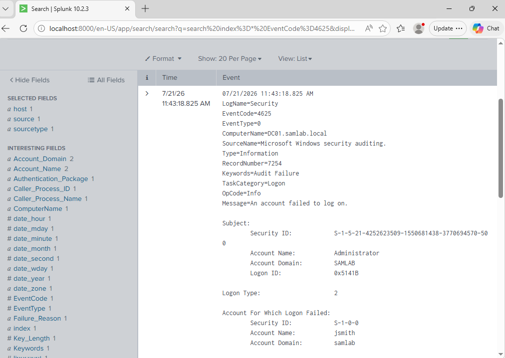

# Windows Security Lab

## Overview

This lab simulates a Windows enterprise environment using VMware Workstation, Windows Server, Active Directory, and Splunk Enterprise. The objective is to configure a domain environment, generate authentication events, and investigate Windows Security logs through a SIEM.

## Lab Environment

- VMware Workstation
- Windows Server 2022 (DC01)
- Windows 11 domain client
- Active Directory Domain Services
- DNS
- Group Policy
- Splunk Enterprise

## Active Directory

The domain controller was configured with:

- Active Directory Domain Services
- DNS
- Organizational Units (OUs)
- Domain users
- Group Policy

The Windows client was joined to the domain and authenticated using domain credentials.

## Authentication Monitoring

A failed authentication was intentionally generated using a domain account.

The event was confirmed in:

- Windows Event Viewer
- Splunk Enterprise

### Failed Logon Search

```spl
index=* EventCode=4625
```

### Successful Logon Search

```spl
index=* EventCode=4624
```

## Splunk Investigation

Authentication events were analyzed to identify:

- Username
- Host
- Event ID
- Logon Type
- Authentication Package
- Time Generated

These events demonstrate how a SOC analyst can investigate failed authentication attempts and distinguish between successful and unsuccessful logons.

## Skills Demonstrated

- Active Directory Administration
- Windows Authentication
- Windows Event Viewer
- Splunk SIEM
- Windows Security Logs
- Security Event Investigation

## Screenshots

### Failed Authentication



### Successful Authentication


### Hosts Reporting to Splunk


